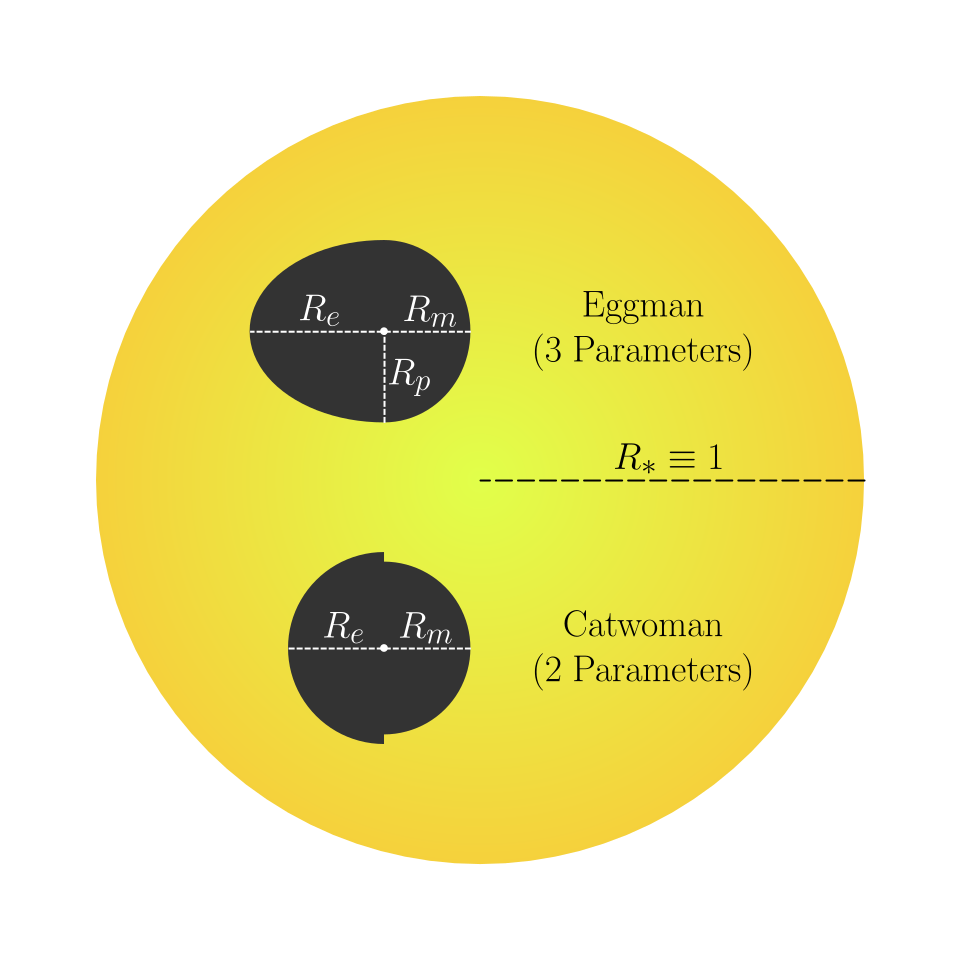

# Eggman
[](https://github.com/dpthorngren/Eggman/actions/workflows/python-test.yml)
[](https://dpthorngren.github.io/Eggman/htmlcov/index.html)
<!-- [](https://dpthorngren.github.io/Eggman/htmlcov/index.html) -->

[**Documentation**](https://dpthorngren.github.io/Eggman/)
Code for calculating the geometry and transit depths of piecewise ellipsoidal objects.

## Installation
Eggman relies on the GNU Scientific Library (GSL), which the user must install before Eggman. This is a C libraries so the Python setup script cannot retrieve them itself. It can be installed through essentially any system package manager: `anaconda::gsl` for [Anaconda](https://anaconda.org/anaconda/gsl), `gsl` [for MacPorts](https://ports.macports.org/port/gsl/), `gsl` for [Homebrew](https://formulae.brew.sh/formula/gsl)and `libgsl-dev` for Linux using apt-get.  It can also be installed directly from the [GSL website](https://www.gnu.org/software/gsl/); just make sure you install it such that the compiler can locate it.

Once the prerequisites are installed, Eggman can be compiled and installed from the terminal with `pip install .` from the Eggman directory.


## Usage



For now the only production ready function is `asymmetricTransit`, which calculates the transit of a piecewise-ellipsoidal planet consisting of two half-ellipses attached at the location of the planet (see diagram on the right).  They have the same polar radius *unless* the polar radius is set to a negative number, which eggman interprets to mean that the two half-circle model of [catwoman](https://github.com/KathrynJones1/catwoman) is to be used, such that the polar radius is `rMorning` for the morning side and `rEvening` for the evening side. <br clear="right">

```python
import numpy as np
import eggman

eggman.asymmetricTransit(
    rMorning=.12,                   # Relative to stellar radius
    rEvening=.1,
    rPole=.11,
    t=np.linspace(-.05,.05,100),    # In any unit, so long as it's the same as t0 and period.
    t0=0,
    period=1.,
    semimajor=10.,                  # Relative to the stellar radius
    inclination=89.,                # In degrees
    limbType='quadratic',           # Must be one of 'quadratic', 'nonlinear'
    limb=[.3, .2],                  # Two parameters for quadratic, 4 for nonlinear
    eccen=0.05,                     # The orbital eccentricity, defaults to zero
    lonPeriapse=65.                 # The longitude of the periapse in degrees (90 is mid-transit)
)
```

## Limb Darkening Settings
The limb darkening of the star is set by the `limbType` and `limb` parameters.  `limbType` is the name of the darkening formula to use and `limb` is the parameters of that formula.  `limb` must have exactly the correct number of parameters for that `limbType`.  Currently, the options for limb darkening types are:

1. `quadratic`, 2 parameters, $I(\mu)/N = 1 - \gamma_0 (1-\mu) - \gamma_1 (1-\mu)^2$
2. `nonlinear`, 4 parameters, $I(\mu)/N = 1 - \gamma_0 (1 - \sqrt{\mu}) - \gamma_1 (1-\mu) - \gamma_2 (1-\mu^{3/2}) - \gamma_3 (1-\mu^2)$

where $N$ is a normalization factor, $\gamma$ are model parameters (specified in `limb`), $\mu$ is the cosine of the angle between the viewer-star vector and the star center-to-surface-point vector.  See [Mandel & Agol (2002)](https://ui.adsabs.harvard.edu/abs/2002ApJ...580L.171M/abstract) for more information.
